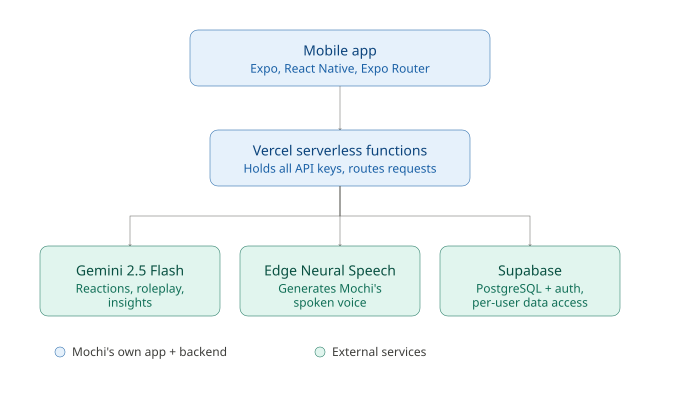

# Mochi 

## What is Mochi?

Mochi is a living wellness companion for anyone who's felt let down by how generic most wellness apps are. Most of them share the same layout, the same generic affirmations, and no real personalisation to how a person is actually feeling on a given day, they behave like tools you check in on, not like something that's actually there with you.

Mochi was built to close that gap. It's designed for people who want more than tracking and tips, it is something that motivates them, stays with them, reflects what they're feeling, and helps them focus and "lock in" when they need to. Three core modes carry that idea: **Mirror**, which reflects and comforts the user based on how they actually feel in the moment; **Rehearsal**, which helps them prepare for real conversations they're dreading; and **Beside You**, which keeps them company and accountable while they work. What makes Mochi different isn't any single feature, it's that wellness support feels personal and present rather than generic and transactional.

## Key Features

### Mirror Mode
Mirror Mode is Mochi's emotional check-in feature. The user can talk to Mochi by voice, the same way they'd use ChatGPT's Voice Mode, or simply type how they're feeling if they'd rather not speak. In response, Mochi does two things at once: it replies with a soothing, empathetic message tailored to what was actually said (never generic advice), and it physically reflects the emotion, shifting color (a pastel red for anger, blue for sadness, and so on), shape, and facial expression to match. This is useful because it gives the user a low-pressure way to actually articulate how they feel and immediately feel seen, rather than being handed a tip before they've even finished explaining themselves.

### Rehearsal Mode
Rehearsal Mode lets a user practice a conversation they're dreading before it happens for real. The user sets the scenario by describing the situation and the personality of the person involved, for example, a strict parent or a stubborn boss. Mochi then roleplays that person: adopting a matching tone, facial expression, and color, and responding realistically (including pushback) across a full back-and-forth exchange, either by text or live voice conversation. This solves a real problem: walking into a hard conversation blind, without having thought through how the other person might actually respond, is a major source of anxiety. Rehearsing it first, with something that talks back, means the user isn't improvising for the first time when it actually matters.

### Beside You
Beside You is Mochi's focus companion mode, built with productivity support in mind for users with neurodivergent conditions like ADHD, who often benefit from working "alongside" someone rather than alone. The user sets a focus timer for a task, and Mochi works visibly alongside them (shown with its own laptop) while lofi music plays in the background, which the user can shuffle. At the end of the session, the user gets an accomplishment acknowledgement plus a research-based wellness tip that Mochi "found" during the session, which gives the user the feeling that Mochi was actually present and working too, not just running a countdown.

### Other Features
- **Mochidle** — a Wordle-style daily game where users guess a wellness-themed word of the day. Succeeding in 3 attempts or fewer unlocks a special Mochi character (Doctor Mochi, Sensei Mochi, etc.), along with a short message that that uses that day's word in the sentence.
- **Streaks, badges and unlockable Mochi characters** — a progress area showing every character the user has unlocked, past accomplishments, and their current focus-session streak, giving visible, ongoing evidence of consistency.
- **Meme of the day** — a daily meme Mochi shares that shows Mochi's sense of humour.
- **Emotional Timeline** — a longer-term view of the user's wellbeing journey: past emotional check-ins and session history across Mirror, Rehearsal, and Beside You, plus AI-generated insights that surface patterns across check-ins over time, rather than treating each mood or session as an isolated event.

## How It Works

- **React Native, Expo, and Expo Router** form the mobile app itself and manage navigation between Mochi's modes.
- **Zustand and AsyncStorage** hold and persist local app state including the user's current mood, chosen base color, streaks, and history so that the app remembers them when reopened.
- **react-native-svg and react-native-reanimated** animate Mochi's body. On top of this, a custom HSL color logic layer takes the user's chosen pastel color and shifts its hue/saturation/lightness based on mood rather than swapping to an unrelated fixed color so Mochi always looks recognizably like "itself," just in a different state.
- **Vercel serverless functions** sit between the app and every external service, so no API key for Gemini, Edge Speech, or Supabase is ever exposed inside the app itself.
- **Google Gemini 2.5 Flash**, called through those Vercel functions, is what actually drives Mochi's reactions, expressions, and conversational responses across Mirror and Rehearsal Mode, as well as the pattern-based insights shown in the Emotional Timeline.
- **Microsoft Edge Neural Speech**, also deployed through Vercel, generates Mochi's spoken voice.
- **Supabase and PostgreSQL** serve as the database and authentication layer, storing user data, check-in history, streaks, and unlocked characters, while making sure each authenticated user can only access their own data.

## Project Architecture



The app never talks to Gemini, Edge Speech, or the database directly. Every request routes through the Vercel functions, which hold all API keys server-side and act as the single point where requests are validated before reaching an external service. Supabase handles both storage and authentication together, so a request tied to a logged-in user is automatically scoped to that user's own data.

## Running Mochi Locally

1. **Clone the repository**
   ```bash
   git clone https://github.com/Nono140503/Mochi.git
   cd mochi
   ```
2. **Install dependencies**
   ```bash
   npm install
   ```
3. **Create environment variables** — add a `.env` file inside the backend/functions folder with your private keys:
   ```
   GEMINI_API_KEY=your_key_here 
   EDGE_TTS_KEY=your_key_here 
   SUPABASE_URL=your_supabase_project_url
   SUPABASE_ANON_KEY=your_supabase_anon_key
   ```
   Make sure `.gitignore` covers `.env` in every folder that has one, this project previously had `node_modules` accidentally committed for exactly this reason. (I forgot to add a .gitignore file to my mochi-api folder)
4. **Set up Supabase** — create a project at supabase.com, configure your tables and authentication rules, and add the resulting keys to your env file.
5. **Start the backend** (if running the Vercel functions locally rather than against the deployed version):
   ```bash
   cd mochi-api
   npm install
   vercel dev
   ```
6. **Run the app**
   ```bash
   npx expo start
   ```
   Scan the QR code with Expo Go to run it on a physical device.

## AI Use and Development Process

**User-facing AI:** Gemini 2.5 Flash is what actually drives everything Mochi says and expresses back to the user: its emotional reflections in Mirror Mode, its live persona roleplay in Rehearsal Mode, and the pattern-based insights generated for the Emotional Timeline. It's called through the Vercel serverless functions rather than directly from the app.

**Development AI:** Since I was building solo, I used Google Antigravity for the majority of the actual development work: generating and correcting code, helping animate Mochi, splitting large feature files into smaller components once they became too long to manage, and writing meaningful git commit messages. In my view, using Antigravity to help build and structure the app itself was the strongest use case of AI in this whole project.

I deliberately broke development work into feature-by-feature prompts: working through one mode or feature at a time (starting with Mirror) rather than asking for the whole app at once so that Antigravity wouldn't lose context or get overwhelmed trying to hold the entire codebase in mind simultaneously. This kept each session focused and made it much easier to review and catch mistakes before moving on to the next feature.

**Real prompt examples used:**
1. *"please give me a commit message for the work we have done so far."* — used to generate accurate, descriptive commit messages, e.g.: `feat: upgrade TTS engine to Edge Neural voice and improve audio routing — Replace paid TTS with free Microsoft Edge Neural Voice (Ava) requiring no API keys or cards — Save TTS base64 to local MP3 via expo-file-system and route playback through main loud speaker — Sort Memories feed timeline newest-first and add mode filter tabs (All, Mirror, Beside You, Rehearsal) — Integrate expo-splash-screen for smooth hydration.`
2. *"we have an important task to do now, everything works so beautifully, but the lines of code are too much, lets separate into components, we can start feature by feature, starting with Mirror"* — used to refactor large files into smaller components, one feature at a time.
3. Used more generally to help build ("vibe code") specific features and animations, including Mochidle and Beside You.

**What I personally reviewed, changed, tested, and decided:** every feature concept and how it should behave, the overall tech stack and architecture, the guardrail requirements and where they needed to apply, and every piece of code before it shipped. When something didn't work as expected such as the splash screen breaking, Supabase RLS misbehaving, TTS running out of tokens I diagnosed and tested the fix myself, sometimes with AI assistance in figuring out the cause, but the decisions about what to change and whether the fix actually worked were mine.

## Safety and Privacy

Mochi is a wellness companion, not a clinical or diagnostic tool. It doesn't replace therapy, medical advice, or professional mental health support, and it isn't designed to handle real medical/health data (which is why it sits in the Wellness track rather than the Health track). As requested by the hackathon's own guidance for mood-related chatbots, guardrails were built directly into the prompts driving Mirror and Rehearsal Mode to prevent Mochi from causing harm: in Mirror Mode, Mochi does not mirror an escalating emotional spiral deeper if a user shows signs of real distress, and instead shifts to grounding and gently points toward real support and in Rehearsal Mode, Mochi's roleplay allows realistic pushback but is not permitted to produce cruelty, threats, or language that normalizes abusive dynamics, regardless of how a user describes the person they're rehearsing with.

On the data side, all user information is stored in Supabase with authentication and Row Level Security in place, so each user can only see and interact with their own check-in history, streaks, and unlocked characters. No user's data is visible to another user.

## Challenges and What I Learned

- **Accidentally committed `node_modules`** for the `mochi-api` folder to the repository. This happened because a `.gitignore` hadn't been added to that directory before I pushed it to GitHub. Fixed once noticed, but a good reminder to set up `.gitignore` in every subfolder with its own dependencies, not just the project root.
- **Finding a voice that matched Mochi's personality** took real trial and error before landing on Microsoft Edge Neural Speech.
- **Animating Mochi was genuinely difficult** since the entire character exists purely as code rather than pre-made animation assets so getting it to feel "alive" rather than static required a lot of trial and error.
- **Adding lofi music was initially a headache** because streaming from web URLs proved unreliable so I ended up downloading the audio files and linking them from the local assets folder instead.
- **Supabase and Row Level Security caused real friction** some data wasn't saving correctly and some information was displaying in the wrong place before the RLS policies were properly configured.
- **The splash icon stopped displaying at one point** with no obvious cause and required consulting AI to help diagnose and resolve it.
- **Started on the Claude API but ran through the token budget faster than expected** and didn't notice for a while. I had to migrate to Gemini partway through the build.
- **The first voice API I used also ran out of usage** requiring a switch to a different provider (Edge Neural Speech).

**What I learned:** Along the way I discovered tools I ultimately didn't use in the final build including Groq's API, which stood out as easy to work with and I explored a few dedicated animation tools before deciding to keep Mochi's animation in code instead. Building solo also meant learning, in practice, how far AI-assisted development tools like Antigravity could be stretched while still making every real decision myself.

**What I'm proud of:** Mochi turned out genuinely adorable, which is what I'm proudest of. It was originally scoped as just 3 features, but every time I finished one I thought of another worth building and I'm proud that despite the scope growing organically, everything still shipped on time.

## Future Plans

The next major feature planned is **"Mochi Friends"** which is a feature built on the idea that Mochi shouldn't be alone. Users will be able to invite friends to use Mochi, and their Mochis will become friends with each other. Users/Friends will be able to chat, check in on one another, and eventually compete through additional games. Better, more expressive animation for Mochi is also planned.

A promo video for Mochi Friends is available here: [Mochi Friends promo](https://drive.google.com/file/d/11PATW9ualmu3C8KKNBXkZzoRFBCsqVel/view?usp=sharing)

## Demo

- **Devpost submission:** [Mochi](https://devpost.com/software/mochi-jdrp31)
- **Demo video:** [Mochi Demo](https://youtu.be/2e826wQdPdM?si=G-v5B-6MV69NECmY)

## Disclaimer

Please kindly note: I (Nombali) built Mochi as a solo developer for a hackathon using mainly AI tools like Google Antigravity. 

This structure was derived from a video on CS Girlies' YouTube channel [Workshop: Building Great Docs for a Great Product with Tal Gluck from GitBook](https://youtu.be/ex2iQha0KnA?si=x1iUq0rIrFAXVZhp). I mainly code so documentation is not my biggest strength. I took the points that the gentleman gave as to how you can achieve having great documentation.